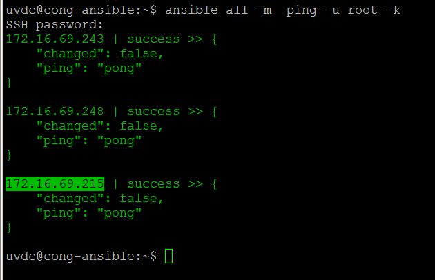

# ghichep-ansible
Ghi chép về ansible


## Mục lục 

### Lịch sử ghi chép
- 14/03/2015: Tạo tài liệu | congto

### Ghi chép

### Vai trò - Chức năng
- Dùng để configuration management
- Là provisioning tool 

### Cách cài đặt
- Mô hình
```sh
                        |------Client1(Ubuntu 12.04)
                        |
Server(Ubuntu 14.04)----|------Client2(Ubuntu 14.04)
                        |
                        |------Client3(CentOS 6.5)
```
- Môi trường
```sh
Trên server: 
Ubuntu 14.04-2 64bit

Phía Client 
Ubuntu 12.04
Ubuntu 14.04
CentOS 6.5
```
- Lệnh cài đặt trên Server
```sh
sudo apt-add-repository -y ppa:ansible/ansible
sudo apt-get update
sudo apt-get install -y ansible
```
- Phiên bản của Ansible hiện tại (14.03.2015)
```sh
root@u14:~# ansible --version
ansible 1.8.4
  configured module search path = None
root@u14:~#
```

- Phía Client không cần cài đặt, chỉ cần cho phép truy nhập ssh bằng pass dạng text hoặc sử dụng ssh-key

Ví dụ về việc thực hiện lệnh ping tới các máy Client trên Ansible.
- Sao lưu file /etc/ansible/hosts trước khi cấu hình
```sh
cp /etc/ansible/hosts /etc/ansible/hosts.bka
``` 

- Tạo file `/etc/ansible/hosts` mới với nội dung như sau
```sh
[local]
127.0.0.1

[web]
# IP cua 03 may client
192.168.0.101
192.168.0.102
192.168.0.103
```

- Thực hiện lện dưới để kiểm tra ping tới các máy Client bằng Ansible (nhớ phải cho phép ssh bằng root tới các client)
```sh
ansible all -m  ping -s -k -u root
```

- Giải thích tùy chọn lệnh
```sh
all : gọi tất cả các server được khai báo trong file hosts (ví dụ này là 04 server, kể cả chính máy chủ cài Ansible Server)
-m ping : sử dụng mô-đun ping trong Ansible để thực hiện lệnh ping.
-s : Sử dụng quyền sudo trên các client.
-k : yêu cầu xác thực khi thực hiện các lệnh từ xa đối với Client.
-u root : đăng nhập và thực hiện lệnh `ping` ở trên bằng tài khoản `root` của Client.

```

- Kết quả sẽ như sau:


### Tham khảo tài liệu
[1] https://serversforhackers.com/an-ansible-tutorial
