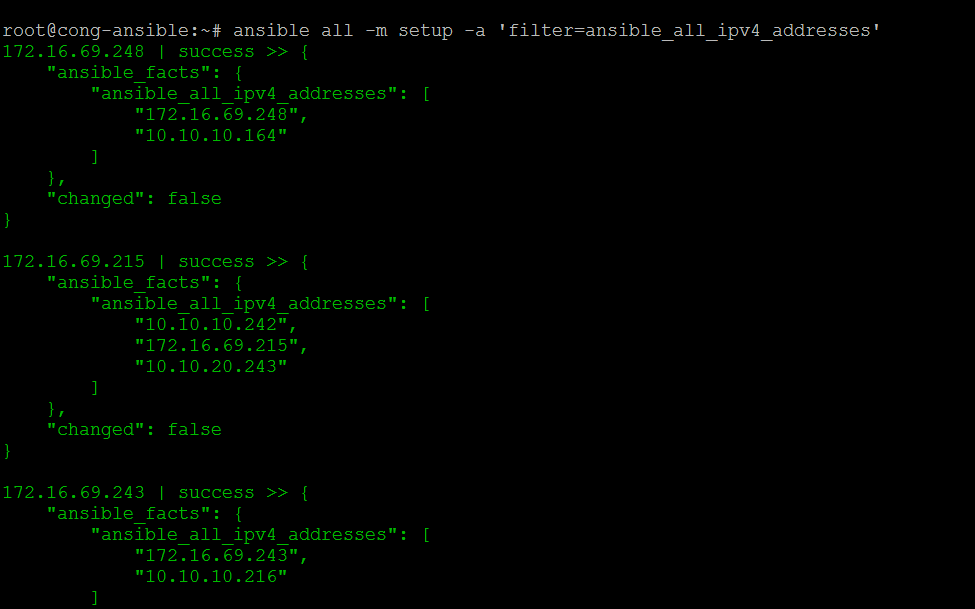
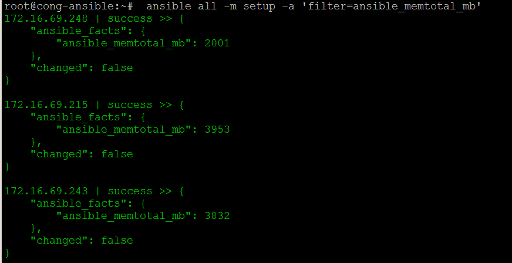
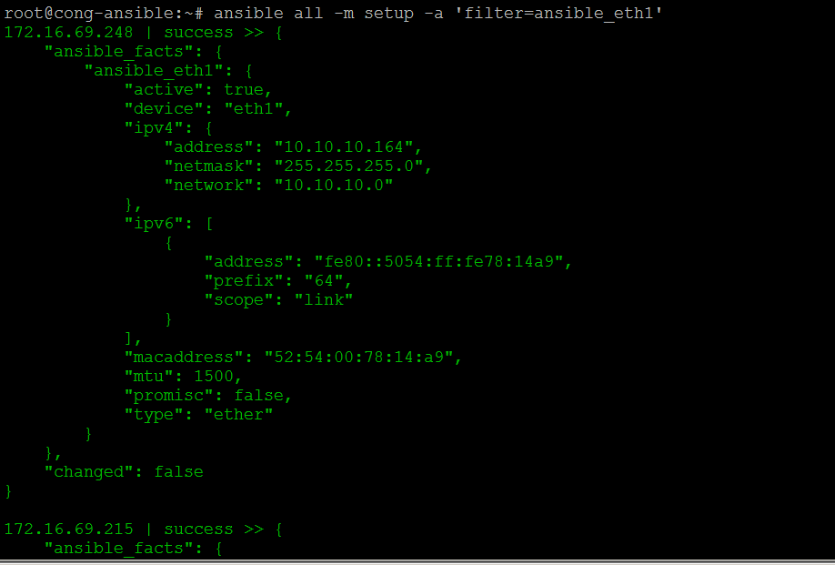
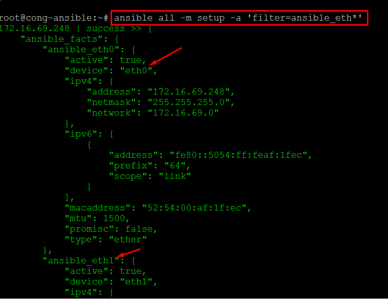

# Cách sử dụng module setup
- Dùng để lấy thông tin về các host ở xa: hostname, IP address, mainboard, kernel, OS version...
- File host như sau:
```sh
# File hosts inventory có khai báo port và pass của user root
[ubuntu]
172.16.69.215 ansible_ssh_port=22 ansible_ssh_pass=123@abc@!
172.16.69.248 ansible_ssh_port=22 ansible_ssh_pass=123@abc@!

[centos]
172.16.69.243 ansible_ssh_port=22 ansible_ssh_pass=123@abc@!

```
### Cách dùng
#### Dùng với lệnh

Ví dụ hiển thị tất cả các thông tin ở host từ xa
```sh
ansible all -m setup
```
Ví dụ dùng với tùy chọn filter để lọc ra các thông tin cần thiết, ví dụ dưới lọc ra thông tin về địa chỉ IPv4 của host ở xa

```sh
ansible all -m setup -a 'filter=ansible_all_ipv4_addresses'
```

Minh họa:


- Ví dụ lấy thông tin về RAM 
```sh
ansible all -m setup -a 'filter=ansible_memtotal_mb'
```
Minh họa:


- Ví dụ xem thông tin về card eth1 của các máy ở xa
```sh
ansible all -m setup -a 'filter=ansible_eth1'
```
Minh họa:


- Có thể sử dụng tùy chọn * kèm trong filter. Lệnh dưới sẽ lọc các thông tin về card bắt đầu là eth
```sh
ansible all -m setup -a 'filter=ansible_eth*'
``
Minh họa:

#### Dùng với playbook

