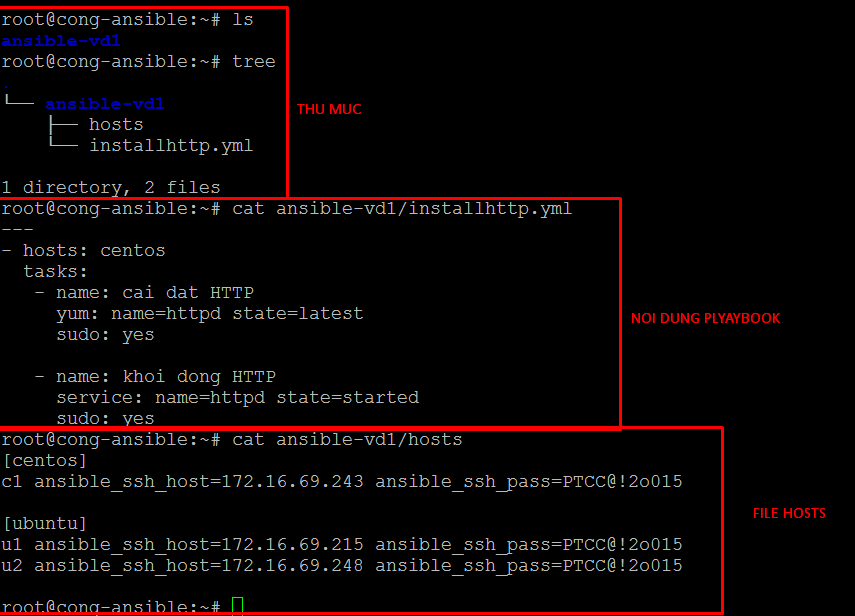
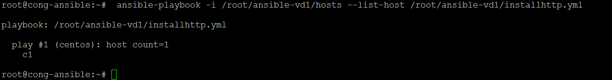
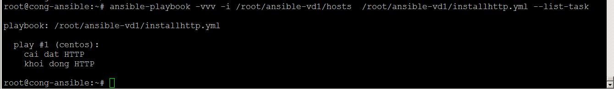

## Các ghi chép về `Playbook` trong `Ansible`
- Task là một việc hay yêu cầu được thực hiện trong Ansible. (#Chỗ này chưa rõ ý lắm)
- Mỗi `task` trong ansible là một play
- Nhiều play kết hợp lại gọi là `Playbook`

### Cú pháp dùng
- Dùng với lệnh
```sh
ansible-playbook file_yaml.yml
```

### Các ghi chú
- Sử dụng Playbook với file host cụ thể, sử dụng tùy chọn `-i`

```
- Minh họa


Sử dụng dụng tùy chọn `--list-hosts` trong `playbook` để kiểm tra các host được áp dụng.
- Minh họa


Sử dụng dụng tùy chọn `--list-task` trong `playbook` để kiểm tra task trong `playbook`

- Minh họa


- Sử dụng tùy chọn --step để thực hiện từng task sau khi người dùng nhập vào
```
 ansible-playbook -i /root/ansible-vd1/hosts  /root/ansible-vd1/installhttp.yml --step
```
Minh họa:


